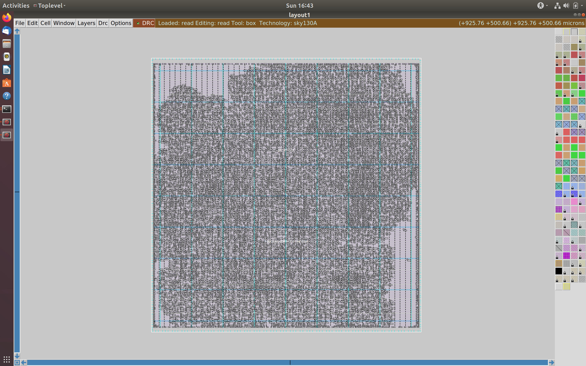

# VSD_SoC_24
Repository containing information and instructions provided during VSD-IAT

## Glossary
### Floorplanning
Step in which all blocks or macros are placed in the chip (core). It also involves creating the iopin placement, power and ground grids.
Defining locations of preplaced cells

	1. Combinational logic can be split up.  

	2. The circuit can be split into "blocks".  

	3. First step is extending io pins.  

	4. The biggest advantage is single implementation and reusing the same implementation  

	5. termed as preplaced as every cells functionality is being implemented and placed 
    only once and must be done before placement and routing. Once fixed, they cannot be moved.  

	6. Come up with a design scenario suitable for the functionality.  

Decoupling Capacitors

	1. Switching causes most current draw.

	2. inherent resistance and inductance cause voltage drop.

	3. VSS needs to be able to sink all current flowing when being pulled down.

	4. This means the circuit may not produce proper output as threshold is not crossed.

	5. essentially this is an issue of noise margins. When the output is ambiguous,
     its an issue as the logic is corrupt. 
    6. We need to reduce distance between source and logic, which is not always possible.

	7. Decoupling capacitors are placed parallel to the source voltage, allowing current
     draw to occur from the capacitor, removing the effects of R	L. The Capacitor is charged 
     through the RL parasitics.

	8. A decoupling capacitor "decouples" the logic and the source. 

	9. All blocks are decoupled to reduce crosstalk, increase noise margin.

Power planning

	1. If a block is constantly being repeated, with a decouplng capacitor,
     the Driver must maintain the logic to load. This requires the same voltage as provided.

    2. Ground bounce occurs when logic changes and multiple capacitors dump the voltage to ground.
     If bounce exceeds   noise margin, output is affected

	3. Voltage droop occurs when multiple capacitors require voltage to attain logic high state.
     Again this affects noise margin.

	4. This is due to a single PSU.

	5. addressing this can be done by separate PSUs.

	6. It reduces the chances of one PSU causing voltage droop or ground bounce.

	7. Power "Meshing" combines multiple Vsources/grounds in a grid like pattern.

Some important terms are:
```math 
Aspect\;Ratio = \frac{Height\;of\;the\;core}{Width\;of\;the\;core}
```
**Core** is defined as the area within which the netlist is placed. (The logic)  

**Die** is the area containing the core. It can be thought of as an outline.   

**Core Utilization** defines the area occupied by the cells and macros. 100% means no space for addition  
of logic/circuits (say buffers, amplifiers etc) or the routing wires.   
Hence standard practice is to aim for ~50% to 60% core utilization, leaving enough to make additions and connections  

**Design Exchange File** called DEF and contains definitions of rows, standard cells, nets etc. It may also contain physical design information.

**Library Exchange File** called LEF and contains information regarding cells, metal layers, vias and design rules.


## Lab-1 Inception of Open Source EDA, OPENLANE and the sky130 PDK
### Let the flow begin! 
```
docker
```
Starts the OpenLane container using docker (alias for a larger invocation)
It is made apparent by the shell name changing to BASH.
```
./flow.tcl -interactive     //required step to initialize the full design flow
```


Following which, it is required to define the packages required, in our case openlane 0.9
```
package require openlane 0.9
```
Before preparing the design, let's go through the file structure
### File Structure
In the directory from which flow.tcl was initialized, use 
```
ls -ltr
```
or 
```
ls
```
To obtain a list of all files and folders.
change directories using ```cd /nameofdirectory```, in this case the designs directory.


The designs Directory is used to store files related to the device, parameters and implementations of aforementioned devices. Here we see multiple designs already created such as a synth_ram, APU etc. Delving further into the filesystem,
```
cd picorv32a
```
The picorv32a is an open source risc-V CPU, available on the yosys github. 


The verilog code is provided inside the src file directory.
It also contains a config.tcl file, a user provided file describing the parameters that the openlane flow tries to adhere to.


### Synthesis
Now that we are familiar with the file structure, lets proceed with the synthesis of the design. However, before synthesis we must prepare the design in question. The picoRV32a will be our chosen design. So, to prepare the design, use
```
prep -design picorv32a //Remember to have the same naming between this and the design directory present in the designs/ directory!
```
Once finished preparing, the output will look something like this


Running this made some changes to our files. Again go to the design directory for picorv32, and cd into runs. a new folder with the current date and time will appear, cd into it. This displays all the directories that will be used in the flow. (which currently are empty) Descending into the tmp directory shows us all the temporary design files.


currently, the information contained within isn't super valuable. 
```
run_synthesis  //runs the synthesis step for whatever design was prepared (picoRV32a)
```
After a short wait, a whole slew of text is displayed, showing the synthesis process. This includes all devices used, the area of the design etc. 


In particular, we are interested in the flip-flop ratio. This can be calculated by a simple formula,
```math
Flop\;Ratio = \frac{Total\;Number\;of\;D\;Flip-flops}{Total\;Number\;of\;cells}
```
```math
Flop\;Ratio = \frac{1613}{14876} = 0.1084296854
```
```math
\%Flop\;Ratio = 10.84296854
```
## Lab-2 Floorplanning and Intro to library cells
### Floorplan

Following the synthesis, we must run the floorplan. The floorplan essentially decides the preplacement of cells, IO, and power/ground grids.

```
run_floorplan
```


Produces the above file based on the priority

	1. specific pdk instances
	2. config.tcl file held locally
	3. configuration/floorplan.tcl

Some parameters are specified including:

	1. UNITS DISTANCE MICRONS 1000
	2. DIE AREA (x0,y0) (x1, y1)
We can use this to find the total area of the die, $660685*671405 = 443587.212425 \mu m^2$


Next, lets examine the floorplan using MAGIC
```
magic -T /home/vsduser/Desktop/work/tools/openlane_working_dir/pdks/sky130A/libs.tech/magic/sky130A.tech lef read ../../tmp/merged.lef def read picorv32a.floorplan.def &
```
Magic GUI along with a TKCON command line will open up. Center the view using S, then V.
Observe that the distance between the pins is equal. Next, hover the cursor on any horizontal pin and press S, and in the TKCON console, type
```
what
```
It will display the metal layer of the selected iopin.
Similarly select a vertical pin and find the metal layer.
In this case, our horizontal io are placed on metal3, and vertical io are placed on metal2.


Adding specific vertical/horizontal metal IO requires modifying the config.tcl
navigate to picorv32a design directory and use 
```
nano config.tcl
```
and add the lines 
```
set::env(FP_IO_VMETAL) 4
set::env(FP_IO_HMETAL) 3
```


### Placement

To run placement, we use
```
run_placement
```
Again, an output def file will be generated, and we will open using magic 
```
magic -T /home/vsduser/Desktop/work/tools/openlane_working_dir/pdks/sky130A/libs.tech/magic/sky130A.tech lef read ../../tmp/merged.lef def read picorv32a.placement.def &
```
Opening this allows us to view the final placement of all blocks:



Zooming in we can see individual blocks and the power grid:


The cells present between the blocks and the IO pins are tap cells: 


### Modified Floorplan

One of the biggest advantages of the OPENLANE flow is that changes can be made on the fly, allowing us to change the design if it is not as expected initially. 
Taking an example of the floorplan IO, post using the command
```
run_floorplan
```

We change the environment parameter for the IO using
```
set ::env(FP_IO_MODE) 2
```

This sets the IO placement to a asymmetric distribution, with some pins overlapping. This type is commonly referred to as the "Hungarian" Placement
Viewing the changes will again require magic so we will run

```
magic -T /home/vsduser/Desktop/work/tools/openlane_working_dir/pdks/sky130A/libs.tech/magic/sky130A.tech lef read ../../tmp/merged.lef def read picorv32a.floorplan.def &
```
And zooming in to the IO pins we observe the changed design

